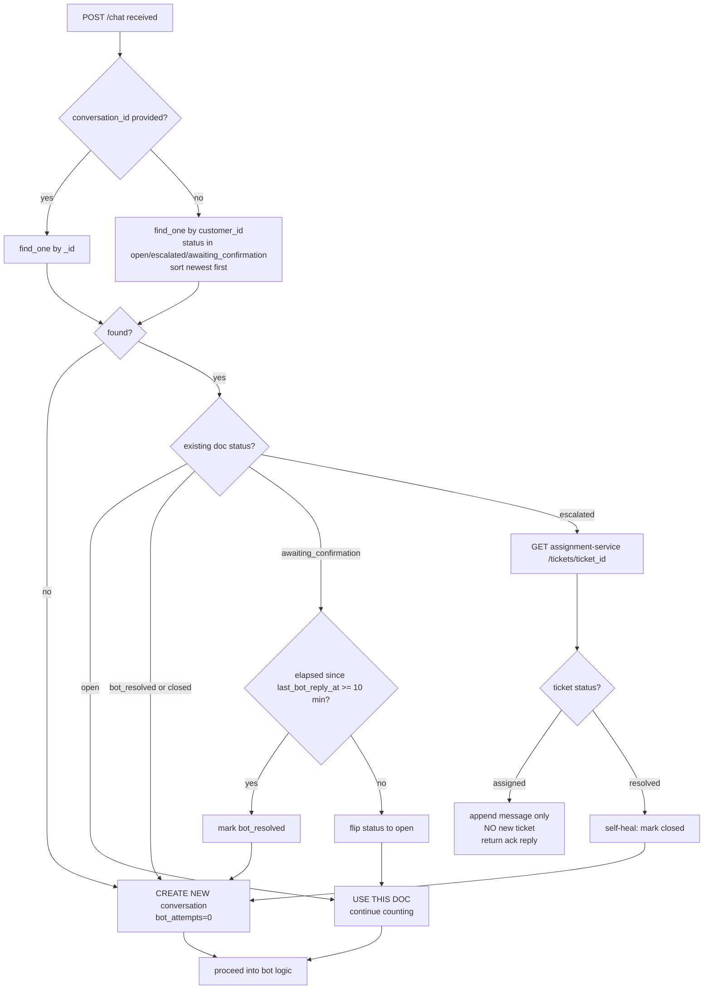
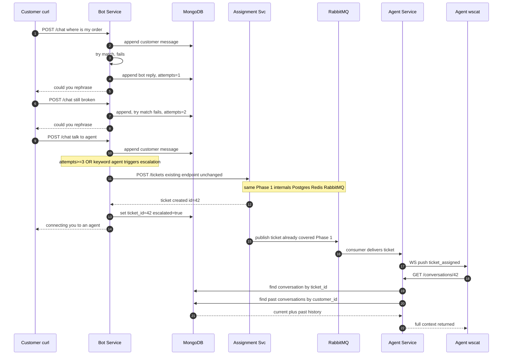

# CRM Platform — Project Reference

## What This Is

An omnichannel customer-support CRM. Customer reaches out via **phone or
chat** → a **bot tries first** (RAG over an SOP knowledge base) → unresolved
tickets are **auto-assigned** to an agent by skill + availability + priority
→ agent resolves via **one-click business actions** (refund/cancel/exchange)
→ customer is notified (Email/WhatsApp/SMS). Supervisors get AI-enriched
Slack alerts on escalation/SLA-breach/angry-sentiment. Built as a portfolio
project **and** informed by real Myntra CRM/MS-Voice-Bot work — both
purposes matter, be honest about which parts are "designed" vs "built."

**Repo is live on GitHub** — `.gitignore` (excludes `.env`) and
`.env.example` (safe placeholders) are set up correctly; real secrets never
committed.

## Governing Instruction — How to Work With the User on This Project

**Give specs, checklists, and reviews. Do not write the code/config files
yourself unless explicitly asked to.** The user learns by building and
wants review afterward, not code handed to them. This was corrected
multiple times early in the build — treat it as a hard rule, not a
preference. Documents (HLD, execution plan, phase specs, this skill file)
are different — those are fine to write/edit directly since they were
explicitly requested as documents, not as the hands-on build itself.
Small, self-contained infra config files (docker-compose fixes,
`mongo-init.sh`, `.gitignore`) have also been written directly on request
— treat these as closer to "documents" than "the hands-on build" too.

**Teaching style that actually lands with this user:** abstract, fragmented
explanations ("Part 1... Part 2... Part 3...") do NOT work — explicitly
called out as confusing more than once. What works: (1) one unified
narrative, not fragments, (2) an explicit table mapping
step → trigger → which store → exact operation (INSERT/UPDATE/DECR/etc.)
→ why, (3) a state diagram for any entity with a lifecycle, (4) a sequence
diagram showing ALL involved systems together in one picture. When
something isn't landing, get MORE concrete (real names, real operations,
a diagram), never more abstract. Give the full connected picture, not a
partial slice.

When asked for "Phase N" or "Task N", default to: a structured
spec/checklist — not generated files — unless the user says "write it" /
"generate it" / "give me the code." When reviewing pasted code, be
direct and complete: list every real bug found, in one pass, with
severity — don't trickle fixes out one at a time across multiple messages
if they're all visible on the first read.

## Reference Files — Read Before Deep Work

- `docs/CRM_Platform_HLD.md` — 18 sections: requirements, every component +
  tech justification, frontend microfrontend architecture (§6), data flows
  (§8), session/transcript management (§9), scaling (§10), reliability +
  named open gaps (§11/§11.1), security (§12), observability/NFR proof via
  Prometheus+Grafana (§13), system design concepts (§14) and building
  blocks (§15), deployment (§16), roadmap (§17).
- `docs/CRM_Execution_Plan.md` — 9-phase build sequence (0 through 9),
  critical path, minimum-viable-demo subset, de-risking notes, per-phase
  interview talking points.
- `docs/PHASE_2A_SPEC.md` — full bot conversation/escalation spec: Mongo
  schema, `status` enum (5 states), complete `POST /chat` decision tree,
  all edge cases (reconnect, staleness, already-escalated), done-when
  checklist.

All docs have been corrected multiple rounds — treat them as current
source of truth over anything summarized here if they ever conflict.

## The 30-Second Mental Model

```
Customer (phone/chat) → Gateway (Node.js BFF) → Bot Service (Azure OpenAI
+ RAG) → resolved, or escalate → Assignment Service (skill+availability
+priority, Redis lookup) → RabbitMQ (agent's priority queue) → Agent
Service (WebSocket, <5s) → agent resolves via Business API Layer → Kafka
event → Notification Service (Brevo: email/WhatsApp/SMS) + Supervisor
Notification Service (Slack, on escalation/SLA/sentiment)
```

**Kafka = event backbone** ("what happened"). **RabbitMQ = task broker**
("what to do next"). Deliberate split, most-probed design decision.

**Kafka is NOT wired up until Phase 3.** Phase 1/2A's flows are
direct/synchronous HTTP calls between services (Gateway → Assignment
Service; Bot Service → Assignment Service on escalation) — no event bus
yet. Don't retrofit Kafka into Phase 1/2 explanations.

**Cross-service calls use plain HTTP (`httpx.AsyncClient`), not
Kafka/RabbitMQ**, whenever the caller needs the answer back in the same
request (e.g. Bot Service needs `ticket_id` immediately to store on the
Mongo doc and reply to the customer). Kafka/RabbitMQ are for genuinely
async, fire-and-forget work — using them for a synchronous need would mean
building request/reply correlation for no benefit. This reasoning
recurs — apply it any time a new inter-service call is being designed.

## Architecture At a Glance

| Layer | Tech | Role |
|---|---|---|
| Gateway | Node.js | BFF — auth, rate limit, routing only, no business logic, no DB access. **Currently near-empty — only `/health` exists; all testing so far hits services directly, bypassing Gateway.** |
| Bot Service | Python/FastAPI + Mongo (`motor`) + `httpx` | Voice+chat first responder. Phase 2A: keyword-match stub; Phase 2B swaps in real Azure OpenAI |
| Assignment Service | Python/FastAPI | Skill+availability+priority routing — **built, verified, done** |
| Agent Service | Python/FastAPI | WebSocket dashboard backend + resolve endpoint — **built, verified, done** |
| Notification Service | Python/FastAPI + aio_pika | Customer Email via Brevo — **Phase 3 Task 7, pending** |
| Supervisor Notification Service | Python/FastAPI | Internal Slack+email alerts, AI-enriched (Phase 4+) |
| Business API Layer | Python/FastAPI (mocked) | Order/Payment/Return/Exchange — circuit-breakered (Phase 6+) |
| Event backbone | Kafka (KRaft mode, no ZooKeeper) | **Phase 3: built** — 4 topics (`tickets`, `conversations`, `agent-availability`, `sla-events`); publishers on assignment/bot/agent services; `sla-tracker` consuming `tickets`, APScheduler+Postgres jobstore, publishes to `sla-events` |
| Task broker | RabbitMQ | Per-agent queues — **Phase 1: built**, plain queue only; TTL/DLQ/priority is Phase 3 Task 8 |
| Hot state | Redis | Agent availability via **TTL + server-driven heartbeat** (primary fast-read layer, self-healing) — **built** |
| Source of truth | PostgreSQL (Cloud SQL) | tickets, agents, agent_actions — **built**. `current_load` + `status` now **actively synced** as the durable fallback layer for availability (Redis-down graceful degradation, Task 5) |
| Conversation transcripts | MongoDB | Document-shaped; audit team is MongoDB-skilled. **Phase 2A: fully built** — `POST /chat`, `GET /conversations/{ticket_id}`, `GET /customers/{customer_id}/conversations`, `PATCH /conversations/{ticket_id}/close` all done and tested |
| Frontend | React, Module Federation | **Phase 9 ONLY — zero frontend exists anywhere in the codebase right now** |

## The 9 Phases — Current Status

| # | Phase | Status |
|---|---|---|
| 0 | Foundation & infra | **Done.** 11 containers, schema applied, 4 agents seeded, pushed to GitHub |
| 1 | Core ticket spine | **Done and verified end-to-end** (multi-ticket, multi-agent, skill-matching, resolve, Redis TTL). See "Phase 1 — Built" below |
| 2A | Bot conversation + escalation storage | **In progress.** Mongo + httpx lifespan built in bot-service; `POST /chat` endpoint speced (`docs/PHASE_2A_SPEC.md`), not yet fully implemented |
| 2B | Real Azure OpenAI swap | Not started |
| 3 | Events + notifications (Kafka goes live) | Not started |
| 4 | AI enrichment + supervisor alerts | Not started |
| 5A–5D | Voice channel | Not started; LiveKit+STT+TTS loop already works (pre-existing real Myntra work) |
| 6 | Business actions (mocked) | Not started |
| 7 | Cloud deployment (GCP+Azure) — **this is where ingress restriction, TLS, LB, service-to-service IAM auth get built** | Not started |
| 8 | Hardening + NFR proof — **this is where Gateway's real auth, rate limiting, CORS get built** | Not started |
| 9 | Microfrontend conversion (4 separate repos) | Not started; deliberately last |

**Zero frontend until Phase 9.** Everything verified via `curl` /
`wscat` / Kafka UI / RabbitMQ Management UI / `mongosh` / Grafana.

## Phase 0 — What Was Actually Built

```
11 containers: postgres, redis, mongodb, kafka (KRaft, confluentinc image),
kafka-ui, rabbitmq, gateway, bot-service, assignment-service,
agent-service, notification-service
schema.sql: agents, tickets, agent_actions + 4 seeded agents (Priya:
  billing/refund, Amit: technical, Neha: delivery/technical, Rahul:
  supervisor, all four skills)
mongo-init.sh: creates conversations collection index automatically
  on first container start (same docker-entrypoint-initdb.d mechanism
  as schema.sql; Mongo accepts .js OR .sh — .sh chosen here)
.gitignore + .env.example: real .env never committed
```

## Phase 1 — Built, Verified End to End

**No Kafka, no DLQ-based reassignment, no priority queues, no
notifications — all Phase 3+.** Linear happy path only, and it works.

**Flow (as actually built):** `POST /tickets` (assignment-service) → INSERT
ticket (Postgres, `status='open'`) → query Postgres for skill-matching
agents (`WHERE $1 = ANY(skills)`) → read Redis `status`/`load` per
candidate → UPDATE ticket assigned (Postgres) → atomic Redis `INCR` →
publish **full ticket JSON** (not just ID — deliberate fix, avoids an
extra DB round-trip in Agent Service) to `agent.{id}.queue` → Agent
Service's background `asyncio.create_task` consumer (`queue.iterator()`,
`message.process()` for ack) → WebSocket push `{event:"ticket_assigned",
ticket:{...}}` → `POST /tickets/{id}/resolve` → UPDATE resolved
(Postgres) + atomic Redis `DECR`.

**Agent availability — dual-layer, graceful degradation (Task 5, the
production-grade version).** Two independent layers, deliberately NOT
synced on every heartbeat:

- **Redis = primary fast-read layer.** `SET agent:{id}:status available
  EX 90`, refreshed by a **server-driven heartbeat** — `agent-service`
  runs a background `asyncio` task (`heartbeat_loop`, sleeps 30s,
  re-SETs the key), cancelled in `finally` on disconnect. NOT client-
  driven — the frontend's only job is keeping the WebSocket open;
  the server owns the heartbeat. This makes Redis **self-healing**:
  after a Redis *restart* (cold, keys gone), each connected agent's
  next heartbeat repopulates their key within ≤30s, no backfill job,
  no reconnect, no intervention.
- **Postgres = durable fallback layer.** `agents.status` +
  `current_load` written on **shift start/end + assign/resolve only**
  (NOT every heartbeat — that would be ~1.4M writes/day at 500 agents;
  shift+ticket writes are ~2000/day, negligible). `assignment-service`
  reads Redis first; if Redis returns `None` (cold key) OR throws
  (Redis *down*), it falls through to a Postgres query. A Redis
  *restart* self-heals via heartbeat; a sustained Redis *failure* is
  covered by the Postgres fallback. Two different failure modes, two
  mechanisms — neither alone is sufficient.

`get_agent_status(pool, redis, agent_id)` helper encapsulates the
Redis-primary/Postgres-fallback read. Redis writes on the *write* path
(`incr`/`decr` load) are also try/except-guarded, with Postgres updated
FIRST (durable) and Redis second (best-effort) — so a ticket still
assigns correctly with Redis down. Login = WS connect writes
`status='available'` to Postgres; explicit `POST /agents/{id}/logout`
writes `status='offline'` + deletes the Redis key (logout is a business
action — shift end — NOT a system-failure cleanup; TTL handles crashes).

**Known gap, deliberately deferred (good interview material):** on Redis
*recovery* after a sustained outage, the `load` counters are stale —
they missed every incr/decr that happened while down. Postgres has
correct values. Fix is a reconciliation step that rehydrates Redis load
from Postgres on reconnect (Postgres = durable source of truth). Not yet
built; noted as a known gap, not an oversight.

**Original Phase 1 note (still true):** this replaced an even earlier
sweep-based (`last_seen` + polling loop) design — the no-polling
instinct that drove that choice is the same one behind APScheduler-not-
polling for SLA (Phase 3) and lazy-not-swept `awaiting_confirmation`
(Phase 2A).

**Known limitation, verified and accepted:** assignment picks the
lowest-ID eligible agent every time (`ORDER BY id`, first match, not
least-loaded) — not true load-balancing. Fine for portfolio-scale
testing; would need revisiting for real multi-agent-same-skill fairness.

## Phase 2A — Bot Service Done and Tested; Agent Service In Progress

See `docs/PHASE_2A_SPEC.md` for the full spec. Current build status:

```
bot-service:  DONE — POST /chat fully implements Step 0/0b/0c
              (resolve_conversation + _handle_awaiting_confirmation +
              _handle_escalated), attempt counting, escalation call
              into assignment-service. Tested: 3-attempt escalation
              accumulates on ONE Mongo doc (not 3 separate ones),
              verified via db.conversations.countDocuments().

agent-service: Mongo client added to lifespan (Task 1 of this
              sub-phase — done). STILL PENDING:
                - POST /tickets/{id}/resolve needs one addition:
                  sync the linked Mongo conversation's status to
                  "closed" (currently only updates Postgres + Redis)
                - GET /conversations/{ticket_id} — not built yet
              Without these, bot-service's self-heal path (in
              _handle_escalated) works correctly but does
              unnecessary repair work every time, since Mongo is
              never told a ticket resolved.
```

Key points worth remembering that aren't obvious from the spec doc alone:

- **`tickets.bot_handled` column is confirmed structurally dead** —
  tickets only ever get created via escalation (bot success never
  produces a ticket), so this column can never be true. Removal
  identified, not yet actioned in `schema.sql`.
- **"Resolved by bot" is a Mongo-only concept** (`conversation.status`),
  never a Postgres one — there's no ticket for the bot to have "resolved."
  Satisfaction is inferred via a `awaiting_confirmation` → `bot_resolved`
  timeout (10 min, checked lazily on next contact — no background sweep,
  same anti-polling instinct as the Redis TTL decision above), not by
  parsing the customer's next reply (unreliable with a keyword-match
  stub; deferred to 2B once a real LLM can classify intent).
- **Escalation ticket `type` is hardcoded to `"billing"`** (`ESCALATION_TICKET_TYPE`
  constant), deliberately, with a `TODO(Phase 2B)` comment — real intent
  classification (HLD §5.13) comes later. Chosen over `"general"`
  specifically because no seeded agent has `"general"` in `skills`,
  which would make every escalated ticket un-assignable during testing.
- **`find_one_and_update` with `$inc`, not read-then-write**, for
  `bot_attempts` — same atomicity discipline as the Redis load-counter
  fix from Phase 1 (HLD §11.1), applied on the first pass this time.
- **`bot-service/main.py` was restructured for maintainability** after
  the first working version — bare status strings replaced with
  `ConversationStatus`/`TicketStatus`/`Sender` enums (a typo now fails
  at import time, not silently at runtime), resolution logic split into
  one function per branch (`_handle_awaiting_confirmation`,
  `_handle_escalated`) instead of one long nested block, repeated
  "push message + set updated_at" extracted into `_append_message()`.
  If regenerating or extending this file, follow this structure — don't
  revert to inline string literals or one giant function.
- Real bugs already caught and fixed across bot-service iterations:
  `api` vs `app` lifespan parameter mismatch; missing `()` on
  `_connect_mongo` (passed the function reference instead of calling
  it — silently defeats `_with_retry`); `await client.close()` when
  Motor's `close()` is synchronous; `ChatRequest` missing the
  `conversation_id` field entirely (silently dropped by Pydantic,
  reuse could never trigger); string vs `ObjectId` mismatch in
  `find_one({"_id": ...})` (needs `ObjectId(conversation_id)` wrapped
  in `try/except InvalidId`); `timedelta` compared directly to a raw
  `int` instead of converting via `.total_seconds() / 60`.

## Key Flow Diagrams (Phase 2A) — Mermaid Source, Renders Natively on GitHub

### Conversation Lookup Decision Tree (`resolve_conversation`, fully built)



### Full Phase 2 Sequence — Escalation Through Agent Context



**Note on the last 5 steps of the sequence above:** `GET /conversations/42`
is the endpoint still pending in agent-service (see Phase 2A status
table above) — this sequence shows the *intended* full flow once that
piece lands, not something fully verified end-to-end yet.

## Phase 3 — Event Backbone (In Progress)

**Done:**
- Kafka infra: 4 topics (`tickets`, `conversations`, `agent-availability`, `sla-events`) via `kafka-init.sh` (idempotent, auto-runs on container start)
- `assignment-service` publishes to `tickets` on every ticket creation (fires even when unassigned — SLA clock starts at creation, not assignment)
- `bot-service` publishes to `conversations` inside `_append_message()` — every message, every branch, every status
- `agent-service` publishes to `agent-availability` on WebSocket connect/disconnect (audit-only, server-driven)
- **Task 5 (Redis + Postgres dual-layer)** — fully built and tested, documented in detail in §11.2 of HLD
- **Task 6 (SLA Tracker)** — new `sla-tracker` service, fully built and tested:
  - `AsyncIOScheduler` + `SQLAlchemyJobStore` → Postgres (`apscheduler_jobs` table auto-created)
  - Consumes `tickets` topic, schedules `sla_warning_{id}` (75%) and `sla_breach_{id}` (100%) as `trigger="date"` jobs (one-shot, auto-removed after firing)
  - Cancels both jobs on `status=resolved` Kafka event (early cancellation — efficiency)
  - ALSO checks Postgres at fire time (correctness — handles the race where resolve arrives after alarm is already queued)
  - Publishes to `sla-events` only if ticket is NOT yet resolved
  - Module-level globals `pg_pool` and `kafka_producer` give job functions access outside request context
  - `SLA_WINDOWS_MINUTES = {"P1": 60, "P2": 240, "P3": 1440}` as config constant
  - Known gap: single-instance only — multi-instance needs leader election or single-owner guard (deferred to Phase 7)

**Pending:**
- Task 7: Notification Service (Kafka consumer on `tickets` for resolved → RabbitMQ → Brevo email). **Known gap: customer email hardcoded as `NOTIFICATION_TEST_EMAIL` env var** — `tickets` table only has `customer_id`, not email. A `customers` table (`id, email, phone, name`) is planned for Phase 6 alongside Business Actions; `notification-service` will be updated then to do `SELECT email FROM customers WHERE id=$1` instead of the hardcoded address. This is explicitly flagged, not hidden.
- Task 8: DLQ reassignment (RabbitMQ TTL + dead-letter-exchange → `assignment-service` consumes DLQ)
- Task 9: No-agent queue with customer ETA

## Production Hardening — Not Yet Built (Important, Don't Imply Otherwise)

Surfaced explicitly when asked "how would this be secured in
production" — worth being direct about status here since it's easy to
undersell how much is still open:

```
Gateway is currently near-empty (/health only). ALL testing so far
hits assignment-service/agent-service/bot-service DIRECTLY on their
own ports, bypassing Gateway entirely. This was correct for iterative
local building, but means none of the following exist yet:

- CORS            — only matters once Phase 9's frontend (a browser)
                     exists; doesn't apply to service-to-service httpx
                     calls at all (CORS is a browser-only mechanism —
                     don't conflate the two)
- Ingress control  — every service port is currently reachable from
                     the host. Production fix: Cloud Run per-service
                     ingress ("internal" for everything except Gateway)
                     — Phase 7
- Service-to-service auth — currently just "trusting the Docker
                     network." Production fix: Cloud Run IAM-based
                     identity tokens between services — Phase 7
- TLS/HTTPS        — everything is plain HTTP locally. Terminates at
                     Cloudflare/GCP LB for public traffic in prod;
                     internal service traffic typically stays HTTP
                     within the VPC trust boundary (standard, not a
                     shortcut) — Phase 7
- L4/L7 LB         — can't meaningfully exist with single local
                     instances. Cloudflare + GCP HTTPS LB + Cloud Run
                     built-in balancing — Phase 7
- Rate limiting    — HLD §13 already specifies token-bucket at
                     Gateway, Redis-backed — not implemented — Phase 8
- Real auth/client validation — still the Phase 1 "auth-stub, checks
                     header presence only" — Phase 8
- Correlation IDs / tracing — HLD §12 names request_id; OpenTelemetry
                     never wired up — Phase 8

None of this is a missed requirement — every item above is already
scoped to Phase 7 (infra-level) or Phase 8 (app-level) in the
Execution Plan. It's flagged here so it's never mistaken for "already
handled" mid-build, and so Phase 7/8 don't get treated as an
afterthought — they're where a real production security story lives.
```

## Reliability Gaps — Documented in HLD §11.1

1. **Dual-write problem** — e.g. ticket INSERT + Kafka publish as two
   separate writes. Fix: Transactional Outbox pattern (not yet built —
   moot until Kafka exists in Phase 3).
2. **Redis check-then-act race** — fixed in Phase 1 via atomic
   `INCR`/`DECR` throughout (done, not just documented).
3. **Ack-timeout not priority-aware + missing load decrement on
   reassignment** — moot until Phase 3's DLQ/reassignment exists.

## Docker/Infra Gotchas Actually Hit

- **`bitnami/kafka` versioned tags fail to pull** (Broadcom removed free
  versioned access, Aug/Sept 2025) — use `confluentinc/cp-kafka:7.6.x`,
  KRaft mode, explicit `CLUSTER_ID`.
- **RabbitMQ's `guest` user is loopback-only since v3.3** — must set
  `RABBITMQ_DEFAULT_USER`/`PASS` to a real user for container-to-container
  AMQP connections.
- **`docker-entrypoint-initdb.d` scripts (both Postgres's `schema.sql`
  and Mongo's `mongo-init.sh`) only run against a FRESH volume** — a
  plain `docker-compose down` (no `-v`) preserves the volume and silently
  skips init scripts on restart. Use `down -v` whenever an init script
  needs to actually fire, including after adding a new one.
- **Healthcheck `interval: 1h` bug** — accidentally set on every service
  early on; meant no healthcheck fired for an hour, blocking all
  `depends_on: condition: service_healthy` chains. Fixed to `10s`
  (`15s`/`10 retries` for Kafka specifically, slower to boot).
- **`CMD ["python", "main.py"]` doesn't start the server** — FastAPI's
  `app = FastAPI(...)` just builds an object; nothing binds to a port
  without `uvicorn.run(...)` or a proper `CMD ["uvicorn", "main:app",
  ...]`. Hit and fixed in `assignment-service`; NOT a universal bug —
  other services' `main.py` files had their own working entrypoint,
  don't assume this bug is everywhere without checking first.

## Mermaid Sequence Diagram Gotcha (Visualizer Tool, This Project)

`sequenceDiagram` (not `erDiagram`) needs its own explicit theme
variables — `actorTextColor`, `actorBkg`, `actorBorder`, `actorLineColor`,
`signalColor`, `signalTextColor`, `labelBoxBkgColor`,
`labelBoxBorderColor`, `labelTextColor`, `noteBkgColor`,
`noteBorderColor`, `noteTextColor`, `activationBorderColor`,
`activationBkgColor`, `sequenceNumberColor` — generic `textColor`/
`lineColor` alone leaves actor-box labels invisible. Hit and fixed once
already; set all of these explicitly every time.

## Production Lessons Carried Over from the Real MS Voice Bot Build

- Provision **all** Azure AI resources in the **same subscription** as
  the runtime — cross-subscription network access is blocked and looks
  like an auth error.
- LiveKit + WebSocket is new infra (ingress, LB, network policy) — don't
  underestimate setup time.
- Langfuse rejected (no India data region) → New Relic AIM. Cekura over
  Hamming for voice regression (call simulation, not just prompt
  regression).

## Repo Layout

```
crm-platform/                    (backend monorepo — on GitHub)
├── .gitignore                   excludes .env
├── .env.example                 safe placeholders, committed
├── docker-compose.yml           Phase 0/1/2A — all fixes applied
├── schema.sql                   agents, tickets, agent_actions + seed
├── mongo-init.sh                auto-creates conversations index
├── README.md
├── gateway/                     Node.js — /health only, near-empty
├── services/
│   ├── bot-service/             Mongo+httpx lifespan built, POST /chat
│   │                            in progress (Phase 2A)
│   ├── assignment-service/      DONE — POST /tickets, GET /tickets/{id}
│   ├── agent-service/           DONE — WS, /resolve, Redis TTL
│   └── notification-service/    /health only, Phase 3
└── docs/
    ├── CRM_Platform_HLD.md
    ├── CRM_Execution_Plan.md
    └── PHASE_2A_SPEC.md

crm-shell/ crm-agent-dashboard-mfe/ crm-customer-chat-mfe/
crm-sop-onboarding-mfe/           (Phase 9 — separate repos, not yet created)
```